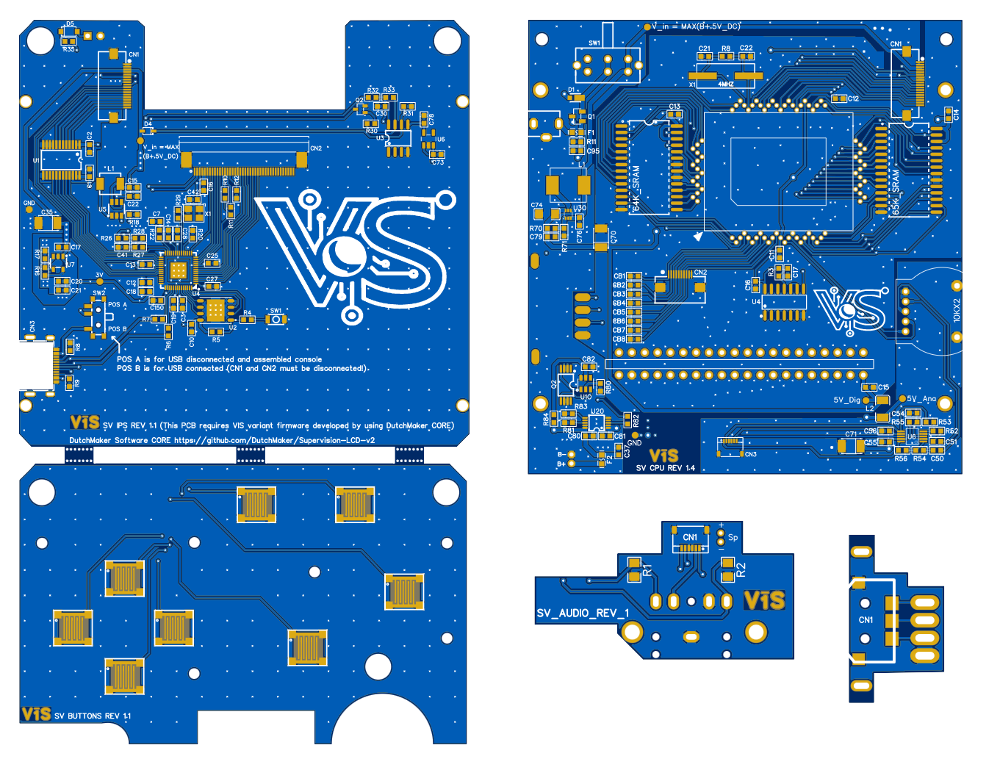

[COME BACK TO HOMEPAGE](../README.md)

## General components that can be purchased on several shops

- Length 8 CM, 10Pin, Pitch 0.5mm, Reverse Direction FPC/FFC cable
- Length 5 CM, 18Pin, Pitch 0.5mm, Reverse Direction FPC/FFC cable
- Length 10 CM, 6Pin, Pitch 0.5mm, Forward Direction FPC/FFC cable
- 1 or 2 Watt speaker (8 Ω) with jst connector
- ER-TFT3.92-1 Display ([Datasheet](https://www.buydisplay.com/download/manual/ER-TFT3.92-1_Datasheet.pdf)) See more details on the [Original DutchMaker Project](https://github.com/DutchMaker/Supervision-LCD-v2)
- 10 cm x 10 cm x 1mm Transparent Acrylic Sheet (if you plan to make a screen lens alone)
- Single and double rows 1.27 pin headers (to grab the PINs required to solder the SV CPU)
- 3.7V 125054 Lipo battery
- 5v 2A USB-C charger with the 2A cable USB adapter (I suggest the right angle version) that can be purchased here [Link Aliexpress](https://www.aliexpress.com/item/4000285082506.html).
- Brackets (3D printed)

## Bill of Materials (MAINBOARD)
    
| Reference Designators    | Description  | Mfr. Part # | LCSC code | 
| ----------------------- | --------------------------------------------------------------------- | --------------------- | --------------------- |
| Power Switch | Slide Switch   | EG2210          | C3664585 |
| Slot cardridge and CPU| grab from the SV PCB   | -         | - |
| Potentiometer B103 10 kΩ 5 pin | [Aliexpress](https://www.aliexpress.com/item/1005007467632806.html)  | -         | - |
| DC Jack 3.5 mm x 1.35 mm | 2A 24V   | DC-002-2.0A-1.3         | C381119 |
| Quartz Crystal |  Crystal 4MHz   | X49SM4MSD2SC   | C13774 |
| RAM (SOP-28 SRAM) x 2 | AS6C6264-55SIN or grab from the SV PCB  | AS6C6264-55SIN          | C1349771 |
| R3, R52, R54 | 20 kΩ 0603 resistor   | RC0603FR-0720KL          | C105575 |
| R8 | 1 MΩ 0603 resistor   | RC0603FR-071ML          | C105578 |
| R11 | 47 kΩ 0603 resistor   | RC0603FR-0747KL          | C105579 |
| R53, R56 (for 1 or 2 Watt speaker) | 15 kΩ 0603 resistor   | RC0603FR-0715KL          | C114661 |
| R55, R71 | 100 kΩ 0603 resistor   | RC0603FR-07100KL         | C14675 |
| R70 | 732 kΩ 0603 resistor   | AC0603FR-07732KL         | C228042 |
| R80 | 1 kΩ 0603 resistor   | RC0603FR-071KL         | C22548 |
| R81 | 10 kΩ 0603 resistor   | RC0603FR-0710KL         | C98220 |
| R82 | 7.5 kΩ 0603 resistor   | AF0603FR-077K5L         | C144113 |
| R83 (for 0.5A charging) | 3 kΩ 0603 resistor   | RC0603FR-073KL         | C126358 |
| R83 (for 0.9A charging) | 1.8 kΩ 0603 resistor   | RC0603FR-071K8L        | C185354 |
| R84 | 100 Ω 0603 resistor   | RC0603FR-07100RL         | C105588 |
| C10, C11, C12, C13, C14, C15, C16, C82, C90, C92, C93, C94, CB1-CB8 | 100 nF 100 V 0603 capacitor | GCJ188R72A104KA01D         | C161117 |
| C17 | 25 V 4.7 μF 0603 capacitor | GRM188R61E475KE11D         | C90057 |
| C21, C22 | 22 pF 50 V 0603 C0G capacitor | CC0603JRNPO9BN220         | C105620 |
| C37, C91 | 10 μF 10 V 0603 capacitor | GRM188R61A106KE69D         | C77044 |
| C50, C51 | 390 nF 16 V 0603 capacitor | GCM188R71C394KA55D         | C437460 |
| C54, C55, C56, C76, C80, C81, C95 | 1 uF 16 V 0603 capacitor | GRM188R71C105KE15D         | C77049 |
| C70, C71 | 100 μF 10 V (tantalum) capacitor | T491B107K010AT         | C122271 |
| C74 | 100 μF 10V 1206 capacitor | GRM31CR61A107ME05L         | C312983 |
| C76 | 22 uF 10V 0603 capacitor| GRM188R61A226ME15D         | C84419 |
| C79 | 100 pF 50V 0603 capacitor| CC0603JRNPO9BN101         | C14665 |
| D1 | 30 V 2 A Schottky Diode | PD3S230HQ-7         | C460243 |
| D2 | 100 mA Switching Diode | 1SS355VMTE-17         | C111695 |
| F1, F2 | 6 V 2 A resettable fuse 0603 | BSMD0603L-200        | C2757930 |
| Q1 | 30 V 4.2 A P channel monsfet | AO3401A       | C306862 |
| Q2 | 20 V 6 A mosfet | FS8205A        | C16052 |
| U10 | SOT23-6 Battery | DW01A        | C18164398 |
| U20 | Charger Ic | MCP73833T-AMI/UN        | C627668 |
| U30 | boost converter | TPS61023DRLR        | C919459 |
| U4 | SN74HC14DR or grab 74HC14 Ic from the SV PCB | SN74HC14DR        | C6820 |
| U6 | Audio Amp VSSOP-10 Amps | LM4853MM/NOPB        | C2872995 |
| L1 | 6A 2.2uH Power Inductor | MHCI06018-2R2M-R8A        | C142092 |
| L2 | 200 mA 5.6 μH 1210 inductor | NLV32T-5R6J-EF       | C295106 |
| CN1 | 18 pins connector 0.5 mm pitch  | AFC01-S18FCA-00          | C262666 |
| CN2 | 10 pins connector 0.5 mm pitch | HC-FPC-0.5-10P-FH20          | C19273927 |
| CN3 | 6 pins connector 0.5 mm pitch  | THD0509-06CL-GF          | C283134 |
| IPS Wheele | Surface Mount Navigation Switch  | COM-08184          | - |

## Bill of Materials (AUDIOBOARD)
    
| Reference Designators    | Description  | Mfr. Part # | LCSC code | 
| ----------------------- | --------------------------------------------------------------------- | --------------------- | --------------------- |
| R1, R2 | 1 kΩ 125mW 0805  | RC0805FR-071KL          | C95781 |
| C1, C2, C3 | 100 μF 6.3V tantallum capacitor  | 6TPE100MAZB          | C79109 |
| CN4 | 6 pins connector 0.5 mm pitch  | THD0509-06CL-GF          | C283134 |
| CN5 | Audio Jack   | PJ-307          | C22355760 |
| CN6 | 2 pins connector for speaker  | 1.25-2AW          | C722595 |

## Bill of Materials (IPS BOARD)

| Reference Designators    | Description  | Mfr. Part # | LCSC code | 
| ----------------------- | --------------------------------------------------------------------- | --------------------- | --------------------- |
| R4, R26, R29, R30 | 1 kΩ 0603 resistor   | RT0603FRE131KL         | C5220830 |
| R5, R10, R11, R12, R20, R22 | 10 kΩ 0603 resistor   | RC0603FR-0710KL         | C98220 |
| R6, R7 | 27 Ω 0603 resistor   | RC0603FR-0727RL         | C137753 |
| R8, R9, R27, R28 | 5.1 kΩ 0603 resistor   | RC0603FR-075K1L         | C105580 |
| R16 | 47 kΩ 0603 resistor   | RC0603FR-0747KL         | C105579 |
| R17 | 33 kΩ 0603 resistor   | RC0603FR-0733KL         | C126359 |
| R18 | 5.1 Ω 0603 resistor   | AC0603FR-075R1L        | C227988 |
| R31 | 1.5 MΩ 0603 resistor   | RC0603FR-071M5L        | C137773 |
| R32 | 7.5 kΩ 0603 resistor   | AF0603FR-077K5L        | C144113 |
| R33 | 4.7 kΩ 0603 resistor   | AC0603DR-072KL        | C227483 |
| R35 | 2 kΩ 0603 resistor   | RC0603FR-074K7L        | C99782 |
| C1, C2, C3, C7, C10, C12, C13, C14, C18, C19, C21, C25, C27, C28, C30, C41, C42 | 100 V 100 nF 0603 capacitor   | GCJ188R72A104KA01D          | C161117 |
| C30 | 25 V 4.7 μF 0603 capacitor   | GRM188R61E475KE11D          | C90057 |
| C15, C150, C73, C78 | 16 V 1 μF 0603 capacitor   | GRM188R71C105KE15D          | C77049 |
| C16, C17, C20 | 10 V 10 μF 0603 capacitor   | GRM188R61A106KE69D          | C77044 |
| C22 | 10 V 220 nF 0603 capacitor   | GCM188R71H224KA64D          | C97857 |
| C35 | 6.3 V 220 μF tantalum capacitor   | 6TPE220MAZB          | C79111 |
| CN1 | 18 pins connector 0.5 mm pitch  | AFC01-S18FCA-00          | C262666 |
| CN2 | 40 pins connector 0.5 mm pitch | 05A20L40P          | C5362161 |
| CN3 | USB-C connector  | TPS16-N1F1-2016-A          | C22357897 |
| D4 | 100 mA switching diode  | 1SS355VMTE-17        | C111695 |
| D5 | Zener diode  | MMSZ5227BT1G        | C154803 |
| Q2 | 45V 100mA Bipolar (BJT)  | BC847W        | C2910228 |
| L1 | 1.2 A 22 μH Inductor  | APH0420T220M        | C5349666 |
| U1 | Logic converter   | SN74LVC8T245PWR        | C27643 |
| U2 | 16 Mbit  memory   | W25Q16JVZPIQ        | C377853 |
| U3 | 2mV 25nA SOIC-8Comparator   | LM393DR        | C67470 |
| U4 | RP2040   | RP2040 or SC0914(13)        | C3227924 or C2040 |
| U5 | Boost converter   | AP3019AKTR-G1        | C44956 |
| U6 | 3.3v LD0 SOT23-5   | NCP161ASN330T1G or TPNCP161ASN330T1G        | C892187 or C3021095|
| U7 | LDO   | SPX3819M5-L/TR        | C9056 |
| X1 |  Crystal   | OT2EL89CJI-111YLC-12M        | C5280582 |
| POWER LED RED | 3 mm red LED (cloudy lens)   | MHL3014SRTS          | C397053 |
| B_LED, C_LED | 0603 blue LED   | 19-217/BHC-ZL1M2RY/6T          | C2986058 |
| SW1 | 3x2 mm tactile switch | 1TS015A-2000-0600-CT        | C256106 |
| SW2 |  switch   | SSSS811101        | C109335 |

## Bill of Materials (BUTTONS BOARD)

| Reference Designators    | Description  | Mfr. Part # | LCSC code | 
| ----------------------- | --------------------------------------------------------------------- | --------------------- | --------------------- |
| Tactile switch (D-PAD. A, B, Start/select) x 8 |  7 mm 0.6 mm Round Button   | SKRRABE010 or SKRRAAE010        | C125046 or C97437|
| CN4 | 10 pins connector 0.5 mm pitch | HC-FPC-0.5-10P-FH20          | C19273927 |

[COME BACK TO HOMEPAGE](../README.md)
