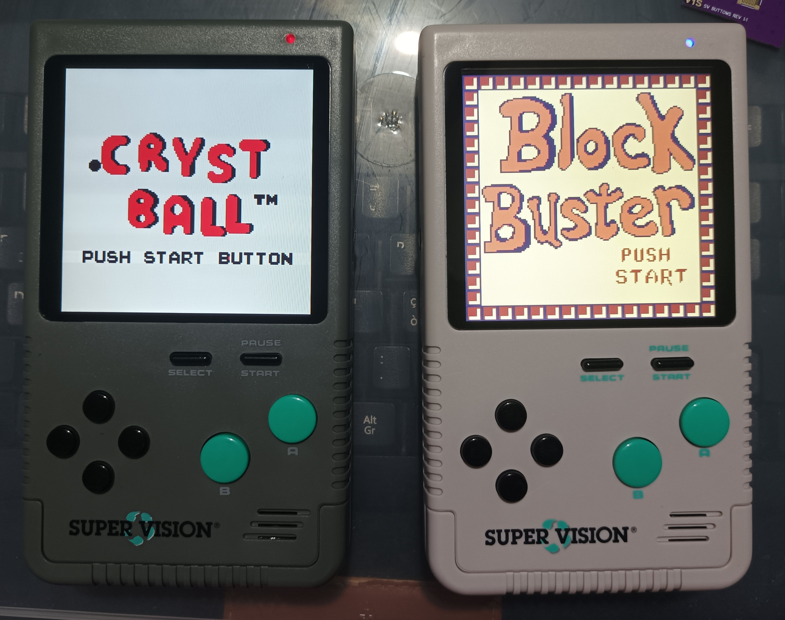
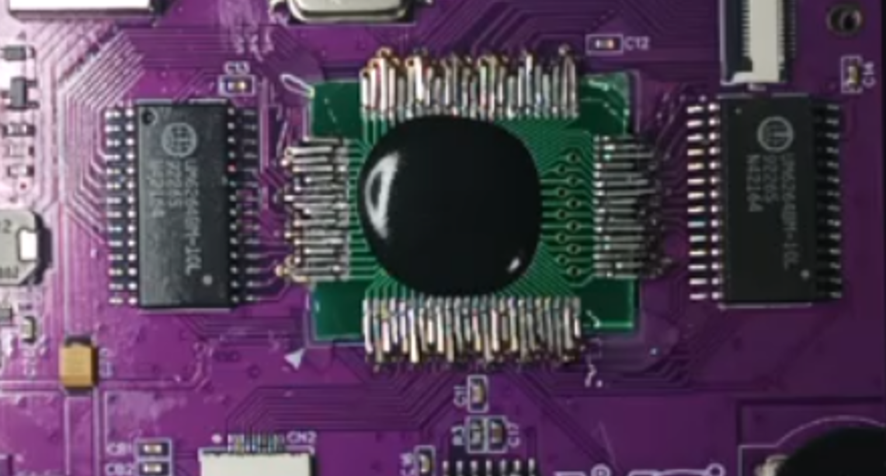
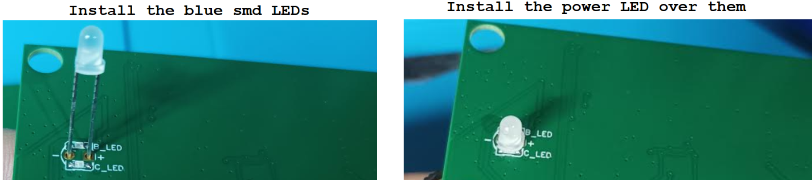
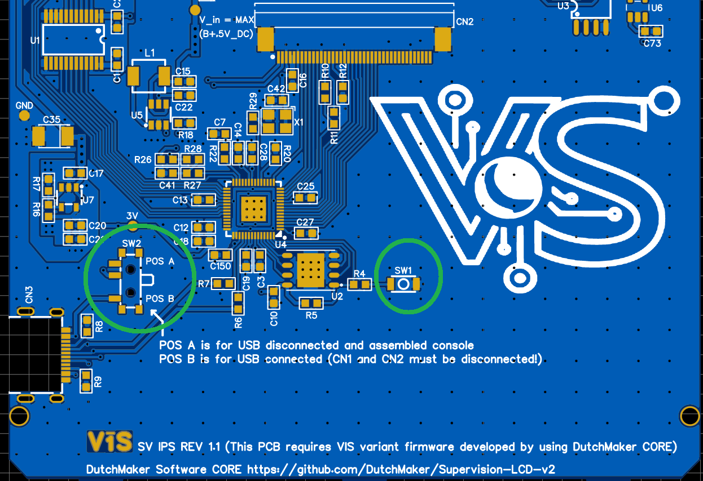

# VIS Watara Supervion PCBs

This project (a complete reboard of the Watara Supervision) had been on my mind for a very long time. However, between other commitments and the lack of a proper modern IPS display solution, I kept postponing it.

Everything changed when [DutchMaker](https://github.com/DutchMaker/Supervision-LCD-v2) released an open-source firmware based on the Raspberry Pi Pico platform. Thanks to its straightforward hardware implementation, I immediately realized it was finally time to take the Watara Supervision out of the drawer and start working on a proper modern redesign.

Thanks to this release, it is now possible to retain only the original CPU and cartridge slot from the Watara Supervision while completely rebuilding the rest of the hardware around modern components. The new design features a high-quality IPS display, a LiPo battery powered charge-and-play system, and a fully redesigned PCB with a much cleaner and more professional layout. Circuits are now properly separated, routing has been greatly improved, and the entire architecture is far cleaner and more reliable compared to the original hardware.

The result is a complete modernization of the console that finally overcomes the limitations of the original design — hardware that was clearly engineered with aggressive cost-cutting in mind.

Because the original CPU is packaged as a chip-on-board epoxy blob, it cannot realistically be desoldered or replaced.
Instead of emulating or redesigning the core logic, I opted for a far less common approach: preserving and transplanting the original CPU PCB section directly onto a completely redesigned motherboard.
Solutions like this are rarely seen in the retro modding scene due to the complexity involved in integrating old and new hardware this cleanly.

For this reason, I would not recommend this project to beginners or anyone with limited soldering and hardware modding experience, as the procedure requires a high level of precision and can easily damage the original hardware if performed incorrectly.

## Disclaimer

**This is a DIY project for electronic enthusiasts. For this reason, I am not responsible for any damage incurred while attempting this project or after completion of the project. You alone accept all risk since you are 100% liable for damage to yourself or your property.**

## Security information for Lipo Battery
The battery is physically distant form the MCP73833T-AMI/UN charger. In addition, the following features are implemented:
- Overcharge and overdischarge protections achieved through the widely used and widespread combo FS8205A - DW01A.
- Load sharing: you can safely play while charging the battery since the battery is disconnected from the load while charging (I use the same circuit of SYF Game Gear since its creator allowed me to use it).
  
## Required Donor parts

In this project, the **strictly required donor parts** are only 
  - the **CPU**.
  - the **Cartdrigde slot**.

## Components list 

[List here](/Components_list/).

## LCD Firmware Features

Compared to the original firmware released by DutchMaker, several new display-related features have been added.
A dedicated on-screen menu is now available by holding the center button, allowing the user to select different display palettes directly from the console.
Outside of the menu, the UP and DOWN buttons can be used to adjust the display backlight brightness on the fly.
Additionally, pressing the center button twice quickly while outside the menu will save both the currently selected palette and the active backlight level into persistent memory.
This save operation is currently the only feature that may occasionally cause instability, as it can interfere with the video capture process and temporarily freeze the display. If this happens, the console simply needs to be power-cycled, while the save operation itself will still complete successfully.

## LED Indicators

The low level battery indicator LED and the charging indicator LED must be soldered under the power LED. I used 2 blue LEDs so with the console ON I get a purple light (blue+red) while charging or if battery is low (under 3.6v). Clearly you will get a blue light while charging with the console OFF. Referr to the following image for a proper installation (the image was taken from another project but essentially it is the same thing).

## Production

In the main folder you find the files for the 3D printed parts and the Gerber files for the audio board and the wheele board (both must be produced with 0.8 mm thickness).
The other boards must be produced on PCBWay at the following links:

## YouTube Video for the setup

[Link_here](https://youtu.be/5hr6UCZzYD0?si=VRYktYd-8LlZ20KM)

## Minimal Instructions to program the Pico Ic
  -  Compile the firmware source files to obtain the UF2 file (follows the [DutchMaker](https://github.com/DutchMaker/Supervision-LCD-v2) repository and ask some help to AI tools).
  -  Populate the IPS PCB.
  -  Without anything connected to the IPS PCB, put the SW2 switch in POS B and keep pressed the SW1 switch while connecting (with an USB cable) the IPS board to a computer. Once connected, a virtual drive will appear on your computer (you can now stop keep pressing SW1). Simply copy the UF2 file onto the drive (at this point the drive will be disconnected from the computer). Disconnect also the USB cable from the IPS board.
  -  Finally, put the SW2 switch in POS A and connect the LCD to the VIS mainboard to test your soldering job.

## Power Consumption 
I have done some fast measurements. Maybe I will carefully update in the future these numbers.

| Setup / Operating State | Input Voltage | Measured Current Draw (Amperometer) | Notes & Component Behavior |
| :--- | :--- | :--- | :--- |
| **Full Load (Max Brightness & Audio)** | 5V DC | ~300 mA (0.3A) | IPS Display at max duty cycle, audio volume at maximum. |
| **Standard Play (Low/Mid Brightness)** | 5V DC | ~170 mA (0.17A) | Optimized brightness levels for battery saving. |
| **Stock Logic Only** | 5V DC | ~55 - 56 mA | Baseline consumption of the CPU/Logic, excluding screen and audio amplification. |

## Credits

- [DutchMaker](https://github.com/DutchMaker/Supervision-LCD-v2) for creating the open-source firmware used to drive the IPS LCD on the Watara Supervision.

- [Tobi](https://www.embedded-ideas.de/posts/250417_open_dmg_display/) (creator of the Open DMG Display / ODD project) for all the support provided during the development of this project, especially regarding LCD backlight management.

- [Modding Marius](https://moddingmarius.com/) for the continuous support and for helping me source an excellent power switch that was used in this project and will likely be useful for future projects as well.

- [Bucket Mouse](https://github.com/MouseBiteLabs/) for the [DMGC](https://github.com/MouseBiteLabs/Game-Boy-DMG-Color) project, from which I took inspiration and reused several ideas throughout this build.

- [consolesandcasks / Deceptive Thinker](https://github.com/consolesandcasks) for the [Heavy CPU MGB](https://github.com/ConsolesandCasks/CPU-MGB-Heavy) project, which I referenced while redesigning and upgrading the DC jack section. He also provided many useful suggestions for the low level battery indicator.

- [Mathijs](https://syf.nl/) from SYF Game Gear for the many suggestions, ideas, and circuits shared with me over the years.

- [Kevtris](http://blog.kevtris.org/blogfiles/Supervision_Tech.txt) for the Supervision reverse engineering notes, which were extremely useful during the development process.

## License
 This work is licensed under a <a rel="license" href="http://creativecommons.org/licenses/by-sa/4.0/">Creative Commons Attribution-ShareAlike 4.0 International License</a>. You are able to copy and redistribute the material in any medium or format, as well as remix, transform, or build upon the material for any purpose (even commercial) - but you **must** give appropriate credit, provide a link to the license, and indicate if any changes were made.
The firmware follows the DutchMaker [NON-COMMERCIAL USE LICENSE](https://github.com/DutchMaker/Supervision-LCD-v2/blob/main/LICENSE) since here it is  published just a variant.

## Contacts

**email**: vis.modding@gmail.com  

**discord**: you can find me as *vis_modding* on several servers (BennVenn, Mouse Bit Lab, Retrosix modding, Game Boy, Gameboy makers, Cybdyn Systems, Pixel FX Official Discord, Modded Gameboy Club).
