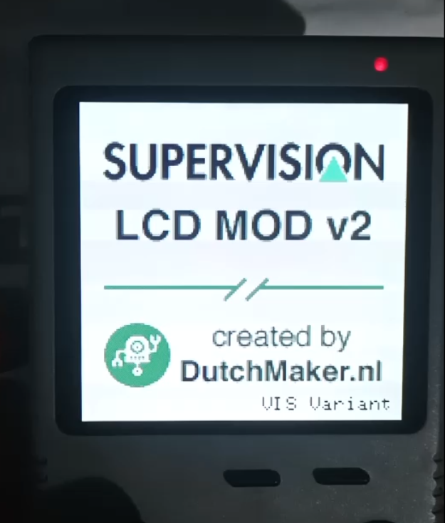

[⬅️ Back to Main](../README.md)

## 🛠️ DutchMaker VIS Variant Firmware

This firmware is a customized version of the **[Original DutchMaker Project](https://github.com/DutchMaker/Supervision-LCD-v2)**. 

> [!IMPORTANT]
> **A huge thank you to DutchMaker** for his incredible work and for sharing the original source code with the community. Without his foundation, this "Total Reboard" project wouldn't have been possible.

This specific fork has been adapted for the **VIS hardware variant**, introducing key improvements to the core synchronization logic and a new physical user interface.

> [!NOTE]
> **Disclaimer:** As I am not an expert in firmware development, I utilized AI tools (Gemini and ChatGPT) to assist in writing the code, debugging synchronization issues, and drafting this documentation. This project is the result of a collaborative effort between human hardware design and AI-assisted software development.


### ⚡ Critical Fixes & Improvements
* **Multi-Core Sync Fix (Volatile Qualifier):** In the original implementation, the `sync` flag (shared between Core 0 for capture and Core 1 for rendering) lacked the `volatile` qualifier. This caused the compiler to cache the variable in registers, preventing the render core from seeing updates from the capture core. 
    * **Result:** Fixed the "stuck on splash screen" issue, ensuring reliable cross-core communication.
* **Render Startup Optimization:** Improved the `render_core()` initialization by forcing `sync = 1` after the first frame. This ensures the render loop activates immediately and stays perfectly in phase with the capture hardware.
* **Physical UI (Thumbwheel):** Added support for a 3-way navigation switch (Up/Down/Click) to manage:
    * **Brightness:** Real-time PWM backlight control.
    * **Palette Switching:** On-screen menu to toggle between color profiles.



### 📜 License & Building
This project follows the **same license** as the original DutchMaker repository. 

To respect the original author's work and ensure hardware compatibility, **pre-compiled binaries (.uf2) are not provided.** You must compile the firmware yourself:

1. Setup the **Raspberry Pi Pico SDK**.
2. Clone this repository.
3. Follow the standard `cmake` and `make` workflow.

> [!IMPORTANT]
> For detailed build instructions, please refer to the [Original DutchMaker Documentation](https://github.com/DutchMaker/Supervision-LCD-v2).

---

### 📺 LCD Interface (8-Bit Parallel)
Sice the data pins are mapped in reverse order (**D0 → GPIO7** through **D7 → GPIO0**) to simplify PCB routing, the firmware includes a fast bit-reversal function. If you are using this firmware on different hardware, you may need to adjust the `reverse_bits()` function in `lcd.c`.


| Signal | Pin (GPIO) | Notes |
| :--- | :---: | :--- |
| **LCD_D0** | 7 | Inverted Mapping |
| **LCD_D1** | 6 | |
| **LCD_D2** | 5 | |
| **LCD_D3** | 4 | |
| **LCD_D4** | 3 | |
| **LCD_D5** | 2 | |
| **LCD_D6** | 1 | |
| **LCD_D7** | 0 | |
| **LCD_RD** | 8 | Read Signal (Active Low) |
| **LCD_WR** | 9 | Write Signal (Pulse) |
| **LCD_DC** | 10 | Data / Command Select |
| **LCD_CS** | 11 | Chip Select |
| **LCD_RST**| 12 | Hardware Reset |

### 🎮 Console Supervision Signals
Dedicated pins for capturing raw video data and synchronization signals from the original console hardware.

| Signal | Pin (GPIO) | Notes |
| :--- | :---: | :--- |
| **DATA 0** | 22 | |
| **DATA 1** | 21 | |
| **DATA 2** | 20 | |
| **DATA 3** | 19 | |
| **P_CLOCK**| 18 | Pixel Clock |
| **F_POL** | 17 | Frame Polarity |

### 🛠️ User Interface & Control
| Signal | Pin (GPIO) | Notes |
| :--- | :---: | :--- |
| **BACKLIGHT**| 16 | PWM Brightness Control |
| **WHEEL_UP** | 25 | Navigation (Internal Pull-up) |
| **WHEEL_MID**| 24 | Menu Select / Click |
| **WHEEL_DWN**| 23 | Navigation (Internal Pull-up) |

---

### ❄️ System Freeze (The Only Firmware Issue)

Due to the real-time nature of this project, writing settings to the Flash memory can occasionally cause the system to freeze. 

## 🎨 Custom Color Palettes

The firmware includes a wide variety of color profiles to enhance the retro-gaming experience. You can cycle through them using the **3-way thumbwheel** (Click to open menu, Up/Down to toggle).

### Built-in Palettes
The following profiles are already available in `lib/palette.c` but if you want to create your own color scheme, you can modify the `palettes` array in `lib/palette.c` before compiling:

```c
static const pal_t palettes[] = {
    {"Default",        {0xB0CB65, 0x607623, 0x415115, 0x1A2108}},
    {"Monochrome",     {0xD2D2D2, 0xAAAAAA, 0x555555, 0x000000}},
    {"DMG Classic",    {0x9BBC0F, 0x8BAC0F, 0x306230, 0x0F380F}},
    {"DMG Tetris",     {0xFFFFFF, 0xFFFF00, 0xFF0000, 0x000000}},
    {"SNES",           {0xF7E7C6, 0xD68E49, 0xA63725, 0x331E50}},
    {"CGB Default",    {0xFFFFB5, 0x7BFF31, 0x00AD52, 0x000000}},
    {"CGB Blue",       {0xFFFFFF, 0x63A5FF, 0x0000FF, 0x000000}},
    {"CGB Dark Blue",  {0xFFFFFF, 0x8C8CDE, 0x52528C, 0x000000}},
    {"CGB Gray",       {0xFFFFFF, 0xA5A5A5, 0x525252, 0x000000}},
    {"CGB Pastel",     {0xFFFFA5, 0xFF9494, 0x9494FF, 0x000000}},
    {"CGB Orange",     {0xFFFFFF, 0xFFFF00, 0xFF0000, 0x000000}},
    {"CGB Yellow",     {0xFFFFFF, 0xFFFF00, 0x7B4A00, 0x000000}},
    {"CGB Green",      {0xFFFFFF, 0x52FF00, 0xFF4200, 0x000000}},
    {"CGB Dark Green", {0xFFFFFF, 0x7BFF31, 0x0063C5, 0x000000}},
    {"CGB Inverted",   {0x000000, 0x008484, 0xFFDE00, 0xFFFFFF}},
};

```
Each palette is composed of 4 colors in HEX (RGB888) format. The firmware will automatically handle the conversion for the display.
Take a look [here](https://tcrf.net/Notes:Game_Boy_Color_Bootstrap_ROM#Assigned_Palette_Configurations) to see for example the background color of CGB that I have used.

[⬅️ Back to Main](../README.md)
